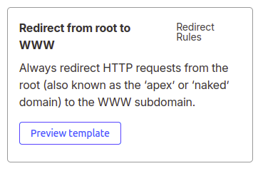
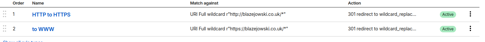
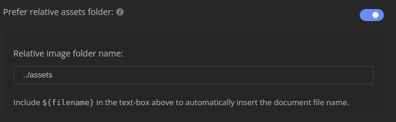
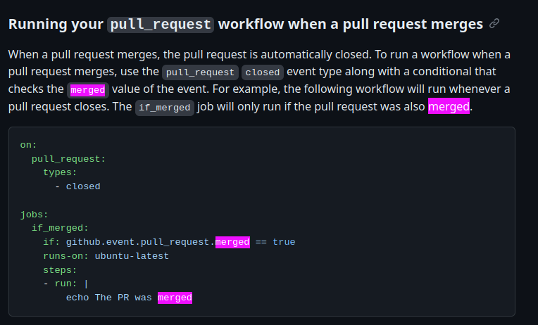
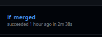
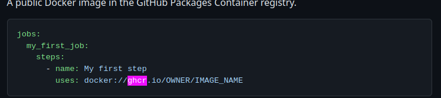
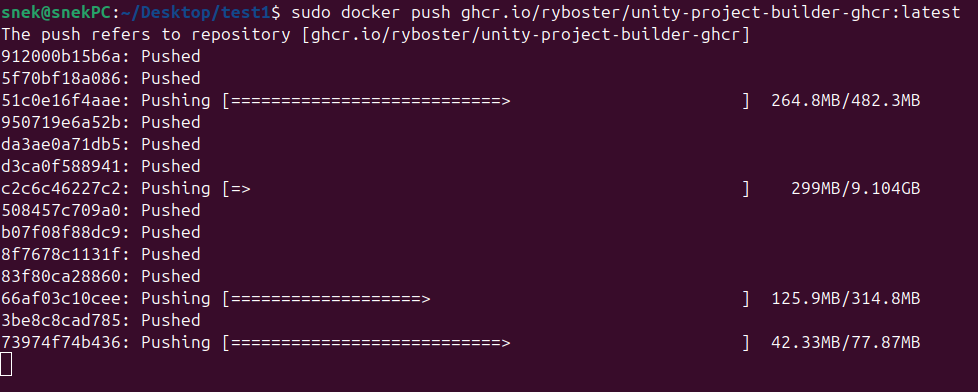

**Date: Wed 04 Mar 2026**  

# Activities

1am - Tried setting up DDNS. Researched how one even does that.

1:20am - Ok, so a DDNS is just a script that makes an API request to your DNS provider - that's how the IP is actually updated. ez-pz,

1:30am - Copied a script from the tutorial. Generated my godaddy API token,

1:40am - Completed the script, ran it, aaaaaand... Godaddy's API is paid. Fantastic! Enshittification at its finest,

1:45am - Looked into alternative DNS providers,

1:50am - Found cloudfare. Their API is seemingly free,

2:30am - Transferred my domain over to cloudflare,

2:40am - Set everything up. Website runs,

2:50am - Created an API token,

3am - Can't justify learning Cloudflare's API just for this one thing. Used AI to rewrite my script for cloudflare,

3:10am - Ran the script and it works!

3:20am - Added the script to my crontab so my website doesn't ever go down again. Finally, no more manual IP resets!

3:30am - Found two mor

3:40am - Hmm, it seems cloudflare handles SSL certs differently. I can't use ZeroSSL anymore because the CNAME record isn't being found so I can't verify that I own the domain. Looked into alternatives,

4am - Found and installed certbot,

4:10am - Generated a new SSL certificate,

4:30am - Looked into how to actually apply the cert,

4:50am - Found it! It's in my nginx.conf. Updated the path to the cert,

4:55am - Excellent! HTTPS works again,

4:56am - Tried adding certbot to cron for automatic renewal. No need. Certbot runs a systemctl process that already handles that for me.

5:10am - Looked into solving the other issue. What I had to do on godaddy before was creating an additional parallel DNS record for requests that excluded www, let's see how it's handled on Cloudflare now,

5:15am - Added a new record with root name. Doesn't work,

5:20am - Huh, so connecting to https://blazejowski.co.uk/ DOES prepend the www, but connecting to https://blazejowski.co.uk (without the slash at the end) doesn't. Interesting,

5:25am - Removed the root name DNS record to see if that's what's doing the prepending,

5:26am - No it wasn't. Apparently it was just my browser being polite. Including the slash at the end opens up a suggestion which prepends the www.

5:28am - A-ha! Turns out you have to set a "Rule" for that in the "Rules" tab,

5:30am - Excellent! They have a thing just for that! Godaddy can go bankrupt for all I care,

5:40am - Huzzah! Got it to work! Now http is being redirected to https, and name requests to www.name,

5:45am - Breakfast break and then off to researching using unity in github actions,

6:25am - Fixed my relative path in MarkText to make sure the included pictures display properly on GitHub.

6:30am - Started researching,

6:45am - From my very cursory research, it seems that the idea is very much feasible. Just how easy it'll prove I don't yet know, but for now I have to research yaml syntax,

6:55am - Found the exact trigger i was looking for:

7:10am - Worked out enough syntax to know more or less what to do. Wrote a quick .yaml script. Managed to download the unity package from apt inside the action. That being said, it doesn't really help me much. It takes around 3 minutes to install all the dependecies so far (and it's not even all of them yet). I need to containerize the requirements in some easily accessible docker container that github can just access without downloading. 

7:40am - Found just the thing. Actions define the "uses" keyword which allows me to use a docker image straight from the ghcr repository without having to download it every time. Looked into the exact docker requirements.

8:20am - Ok, there is a docker base image built for this exact purpose; `# unityci/editor:ubuntu-2022.3.13f1-webgl-3`! Hoorah! 

8:30am - Looked up how to upload a built image to ghcr,

8:35am - Started building the container. This will take a while ...

9am - While building, I shared the discoveries with my team,

9:10am - Finished building,

9:20am - Uploading!

9:25am - This is going to take a while ... There's around 10gb to upload. Quick break.

11am - FINALLY finished uploading. Off to the .yaml,

# Issues/Errors

3:30am - Found two issues. 1. `www` is now required. 2. HTTPS doesn't work,

8am - Tried building a debian container. `unity` doesn't exist on debian. I need a more specialized docker base image,

11:25am - The action is trying to pull the image before my authentication step. Luckily there is a thread of someone who had the exact same problem,

 

# Next Steps

 

## Resources

[Quick and Dirty Dynamic DNS Using GoDaddy : 4 Steps - Instructables](https://www.instructables.com/Quick-and-Dirty-Dynamic-DNS-Using-GoDaddy/)

https://community.cloudflare.com/t/how-to-delete-www-domain-name/236611/2

[Automating Unity Builds with GitHub Actions - Learn Content - Unity Discussions](https://discussions.unity.com/t/automating-unity-builds-with-github-actions/1560931)

[Automating Unity Builds with GitHub Actions](https://www.virtualmaker.dev/blog/automating-unity-builds-with-github-actions)

https://docs.github.com/en/actions/reference/workflows-and-actions/workflow-syntax

https://docs.github.com/en/actions/reference/workflows-and-actions/events-that-trigger-workflows

https://stackoverflow.com/questions/59954185/github-actions-split-long-command-into-multiple-lines

https://medium.com/devopsturkiye/pushing-docker-images-to-githubs-registry-manual-and-automated-methods-19cce3544eb1

[Image Layer Details - unityci/editor:ubuntu-2022.3.13f1-webgl-3](https://hub.docker.com/layers/unityci/editor/ubuntu-2022.3.13f1-webgl-3/images/sha256-c852801b98a44baf04c67a787691259c4a88457327ec6cb59f12ea9ad0f9ddfd)

https://medium.com/devopsturkiye/pushing-docker-images-to-githubs-registry-manual-and-automated-methods-19cce3544eb1

https://fadhilnoer.medium.com/automating-unity-builds-part-1-ba0c60e8d06b

[How to run login before pulling docker images? · docker/login-action · Discussion #669 · GitHub](https://github.com/docker/login-action/discussions/669)

 
