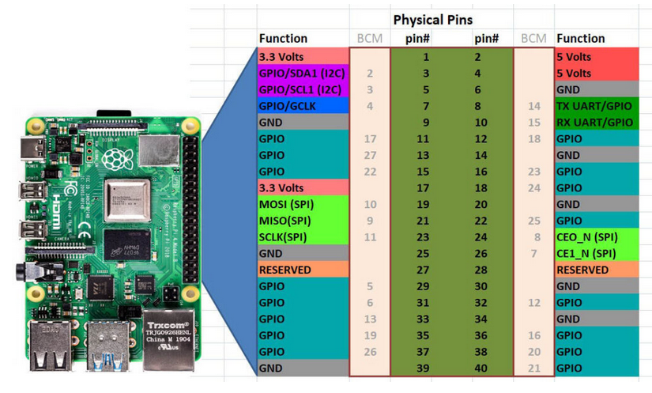

**Date: Mon 6 Oct 2025** 

# Activities

1:30am - Added ability to a add images to entries in Djalio.

1:40am - Added .gitignore and protected my databases from leaks.

2am - Uploaded whole project on github.

2:30am - Released project on github.

2:40am - Shared release on LinkedIn.

3am - Checked for database leaks in previous commits - No leaks.

5am - Got to work on a new project of mine - quickReader

5:05am - Got an error. Started resolving.

5:35am - Resolved the error. Found documentation on the two libraries i'm going to use for this project.

8am - Sleep.

6pm - Found and printed a set of funnels.

6:30pm - Got to work on my QuickEbookReader project.

6:50pm - Researched destructors in python.

9pm - Finished writing the script. Added a README.md, and a short video showcasing it working. Released the project on github. [Release First Stable · Ryboster/QuickEbookReader · GitHub](https://github.com/Ryboster/QuickEbookReader/releases/tag/v1)

9:20pm - Researched identification vs admiration in psychology.

 

# Issues/Errors

 

# Next Steps

 

## Resources

[Raspberry gPIo - SparkFun Learn](https://learn.sparkfun.com/tutorials/raspberry-gpio/python-rpigpio-api)

[raspberry-gpio-python / Wiki / BasicUsage](https://sourceforge.net/p/raspberry-gpio-python/wiki/BasicUsage/)

[Getting Started &mdash; RPLCD 1.3.0 documentation](https://rplcd.readthedocs.io/en/stable/getting_started.html)

[Introduction to Python Raspberry Pi (RPiGPIO) Library - GeeksforGeeks](https://www.geeksforgeeks.org/python/introduction-to-python-raspberry-pi-rpigpio-library/)

[Destructors in Python - GeeksforGeeks](https://www.geeksforgeeks.org/python/destructors-in-python/)
