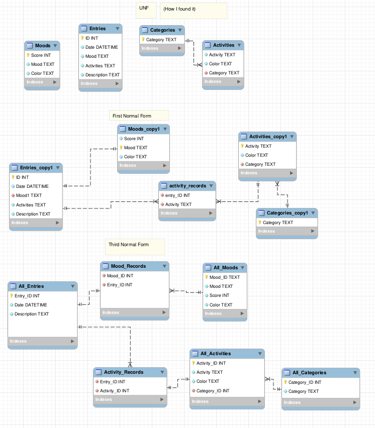

**Date: Sun 21 Sep 2025** 

# Activities

12pm - Finally managed to get into my raspberry pi 4. 

12:30pm - Connected to it via ssh. Looked at my websites.

1pm - Started analyzing the database schema of my `djalio` web app.

1:30pm - Referencing Charles' resources, I went ahead and replicated the schema in MySQL Workbench. Started upgrading it to NF3.

3pm - Upgraded my database design from UNF to NF3.

4:40pm - Started implementing the new database schema.

 

# Issues/Errors

 

# Next Steps

 

## Resources

 
