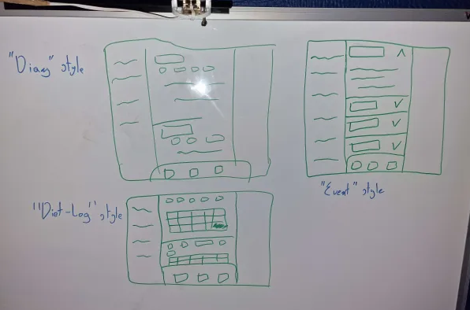
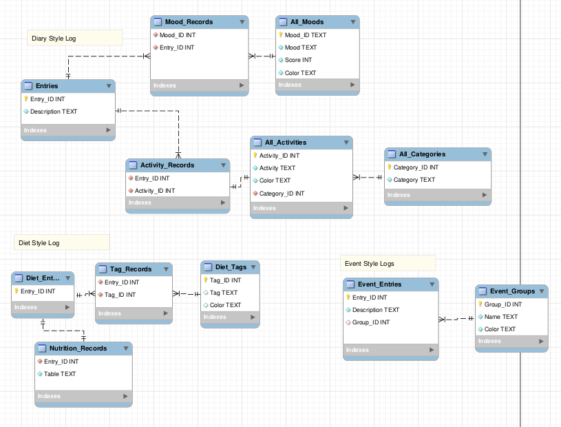
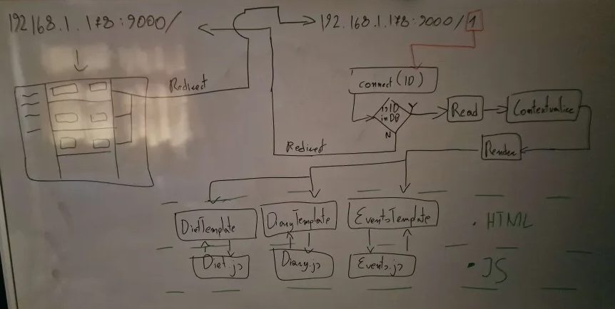
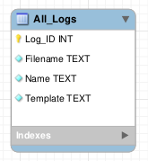

**Date: Tue 23 Sep 2025**<br>

# Activities

6am - Wakey wakey

6:30am - Thought of new endpoints. Came up with the idea to make a couple different templates for logs (e.g. a timeline, a journal, and a journal of tables) and give
 the user the ability to create as many new logs as they want for whatever purpose they need em. This will make the site a lot more modular, users will get a lot more utility out of it, and I won't have to work on manually adding new endpoints whenever I think of logging a new thing.

7:50am - Designed new endpoint templates.



8am - Got to work on planning out the database schema for each template.

8:20am - Done designing.



8:20am - Food.

9am - Eaten. Something still isn't right with this design.

9:10am - I'm going to need another table for cataloguing other tables. Something like "All_Logs".

9:50am - Using this hypothetical table i made a quick flowchart to see how it would work and to outline what this table is going to need. From it, I deduced it's going to need a name, and a template.



9:55am - Got to work on designing the table.

10am - Done.



10am - Got to work on developing the endpoints.

10:20am - Wrote my sqlite3 creators for each database (see in #Resources).

10:30am - Experienced a slight drop in efficiency. Logged it for future analysis. Might mean I'll have to change task soon.

10:35am - Got to work on a database creation endpoint.


11:40am - Created a new endpoint for creating new logs.

11:45am - Left to library to print out patient registration forms.


# Issues/Errors

<br>

# Next Steps

<br>

## Resources

```python
ALL_LOGS_DB_CREATOR = """
    CREATE TABLE IF NOT EXISTS All_Logs (
        Log_ID INTEGER PRIMARY KEY NOT NULL,
        Filename TEXT NOT NULL CHECK(typeof(Filename) = 'text'),
        Name TEXT NOT NULL CHECK(typeof(Name) = 'text'),
        Template TEXT NOT NULL CHECK(typeof(Template) = 'text')
    );
"""
DIARY_DB_CREATOR = """
    CREATE TABLE IF NOT EXISTS All_Categories(
        Category_ID INTEGER PRIMARY KEY AUTOINCREMENT NOT NULL,
        Category TEXT NOT NULL CHECK(typeof(Category) = 'text')
    );

    CREATE TABLE IF NOT EXISTS All_Activities (
        Activity_ID INTEGER PRIMARY KEY AUTOINCREMENT NOT NULL,
        Category_ID INTEGER NOT NULL,
        Activity TEXT NOT NULL CHECK(typeof(Activity) = 'text'),
        Color TEXT NOT NULL CHECK(typeof(Color) = 'text'),
        FOREIGN KEY (Category_ID) REFERENCES All_Categories(Category_ID)
            ON DELETE CASCADE
    );

    CREATE TABLE IF NOT EXISTS All_Moods (
        Mood_ID INTEGER PRIMARY KEY AUTOINCREMENT NOT NULL,
        Mood TEXT NOT NULL CHECK(typeof(Mood) = 'text'),
        Score INTEGER NOT NULL CHECK(typeof(Score) = 'integer'),
        Color TEXT NOT NULL CHECK(typeof(Color) = 'text')
    );

    CREATE TABLE IF NOT EXISTS Entries (
        Entry_ID INTEGER PRIMARY KEY NOT NULL,
        Description TEXT NOT NULL CHECK(typeof(Description) = 'text')
    );

    CREATE TABLE IF NOT EXISTS Mood_Records (
        Entry_ID INTEGER NOT NULL CHECK(typeof(Entry_ID) = 'integer'),
        Mood_ID INTEGER NOT NULL CHECK(typeof(Mood_ID) = 'integer'),
        FOREIGN KEY (Entry_ID) REFERENCES Entries(Entry_ID)
            ON DELETE CASCADE,
        FOREIGN KEY (Mood_ID) REFERENCES All_Moods(Mood_ID)
    );

    CREATE TABLE IF NOT EXISTS Activity_Records (
        Entry_ID INTEGER NOT NULL,
        Activity_ID INTEGER NOT NULL,
        FOREIGN KEY (Entry_ID) REFERENCES Entries(ENTRY_ID)
            ON DELETE CASCADE,
        FOREIGN KEY (Activity_ID) REFERENCES All_Activities(Activity_ID)
            ON DELETE CASCADE
    );
"""

EVENTS_DB_CREATOR = """    
    CREATE TABLE IF NOT EXISTS Groups (
        Group_ID INTEGER PRIMARY KEY NOT NULL,
        Name TEXT NOT NULL CHECK(typeof(Name) = 'text'),
        Color TEXT NOT NULL CHECK(typeof(Color) = 'text')
    );

    CREATE TABLE IF NOT EXISTS Entries (
        Entry_ID INTEGER PRIMARY KEY NOT NULL,
        Description TEXT NOT NULL CHECK(typeof(Description) = 'text'),
        Group_ID INTEGER,
        FOREIGN KEY (Group_ID) REFERENCES Groups(Group_ID)
    );
"""

DIET_DB_CREATOR = """
    CREATE TABLE IF NOT EXISTS Entries (
        Entry_ID INTEGER PRIMARY KEY NOT NULL
    );

    CREATE TABLE IF NOT EXISTS Diet_Tags (
        Tag_ID INTEGER PRIMARY KEY NOT NULL,
        Tag TEXT NOT NULL CHECK(typeof(Tag) = 'text'),
        Color TEXT NOT NULL CHECK(typeof(Color) = 'text')
    );

    CREATE TABLE IF NOT EXISTS Nutrition_Records (
        Entry_ID INTEGER NOT NULL CHECK(typeof(Entry_ID) = 'integer')),
        Table TEXT NOT NULL CHECK(typeof(Table) = 'text'),
        FOREIGN KEY (Entry_ID) REFERENCES Entries(Entry_ID)
            ON DELETE CASCADE
    );

    CREATE TABLE IF NOT EXISTS Tag_Records (
        Entry_ID INTEGER NOT NULL CHECK(typeof(Entry_ID) = 'integer'),
        Tag_ID INTEGER NOT NULL CHECK(typeof(Tag_ID) = 'integer'),
        FOREIGN KEY (Entry_ID) REFERENCES Entries(Entry_ID)
            ON DELETE CASCADE,
        FOREIGN KEY (Tag_ID) REFERENCES Diet_Tags(Tag_ID)
            ON DELETE CASCADE
    );
"""
```

<br>
