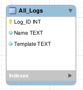

**Date: Tue 23 Sep 2025** 

# Activities

6am - Wakey wakey

6:30am - Thought of new endpoints. Came up with the idea to make a couple different templates for logs (e.g. a timeline, a journal, and a journal of tables) and give
 the user the ability to create as many new logs as they want for whatever purpose they need em. This will make the site a lot more modular, users will get a lot more utility out of it, and I won't have to work on manually adding new endpoints whenever I think of logging a new thing.

7:50am - Designed new endpoint templates.

8am - Got to work on planning out the database schema for each template.

8:20am - Done designing.

8:20am - Food.

9am - Eaten. Something still isn't right with this design.

9:10am - I'm going to need another table for cataloguing other tables. Something like "All_Logs".

9:50am - Using this hypothetical table i made a quick flowchart to see how it would work and to outline what this table is going to need. From it, I deduced it's going to need a name, and a template.

9:55am - Got to work on designing the table.

10am - Done.

10am - Got to work on developing the endpoints.

# Issues/Errors

 

# Next Steps

 

## Resources

 
