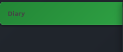
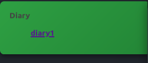
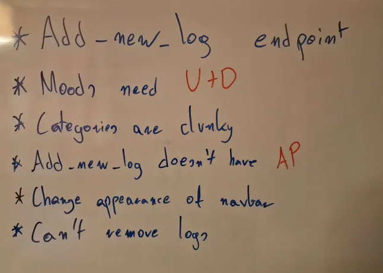
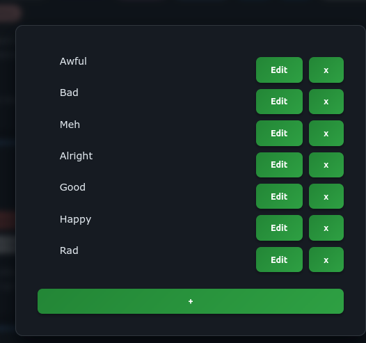
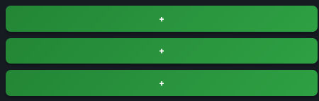

**Date: Wed 24 Sep 2025**<br>

# Activities

4:30am - Wakey wakey.

5am - Got to work on solving the navigation problem on my site. First, I need a `base` template that the `diaries` template extends. Then, I need to broaden (add another thing to) the context with the all the endpoints from the registry.

5:30am - Added the `base.html` template. extended my `diaries.html` template with it. Added a `populate_endpoints.js` script to my `base.html` for populating the navbar. Now onto contextualizing the registry.

6am - Added a new class `Registry_Reader` for reading the registry and generating context objects on behalf of other classes.

```python
class Registry_Reader(CRUD):
    def __init__(self):
        super().__init__()
        self.CONTEXT_REGISTRY = {}

    def ReadRegistry(self):
        registry = self.Read_DB(self.REGISTRY_DB_FILENAME, "All_Logs")        
        for record in registry:
            self.CONTEXT_REGISTRY[record[0]] = {}
            self.CONTEXT_REGISTRY[record[0]]["Filename"] = record[1]
            self.CONTEXT_REGISTRY[record[0]]["Name"] = record[2]
            self.CONTEXT_REGISTRY[record[0]]["Template"] = record[3]
```

6:30am - `Registry_Reader` now inherits from `CRUD`, and higher level classes like `Diary` (a class responsible for rendering `diaries` saved in the database) inherit from `Registry_Reader`. All constants relating to the databases are now saved in the `CRUD` and inherited by other classes. This makes the code a lot more maintainable.

```python
class CRUD():
    def __init__(self):
        self.DB_EXTENSION = ".sqlite3"
        self.DATABASES_ROOT_DIR = "Databases"
        self.REGISTRY_DB_FILENAME = "Registry"
        self.createDatabases()
        self.initializeDatabases()
```

7am - Successfuly contextualized the registry and passed it over to `base.html`. Got to work on `populate_endpoints.js` script to populate the navbar with endpoints to different logs.

7:20am - Researched collapsibles.

7:30am - Breakfast break.

8:30am - Back to researching collapsibles and figuring out how they work.

8:45am - Ok. Collapsibles are essentially just buttons with invisible children with an `onclick` function that reveals the children. Easy as.

9:05am - Added the collapsibles. It works toots sweet. Don't really know what to do next. I'm quite proud and excited about what i've just done; I just made this website a lot more useful. Instead of it being just a single log you can now add and manage as many of them as you want - sky's the limit. I guess next up I'm gonna tidy up the whole interface, tidy up the code a little bit, and then get to work on introducing more templates so it's even more useful.



9:20am - Made a quick list of things that need to be changed before i can move on to adding more templates:



10am - Tidied up code a little bit. Moved the database creation queries off to a separate class called `DatabaseCreationQueries`, and inherited from that class in my `CRUD`.

10:10am - Added endpoints for editing and removing moods to `urls.py` (Django).

10:30am - Added forms for editing and removing moods to my `diaries.html` and `diaries.css` documents.

12pm - Started reworking the `Add Mood` button. Instead of displaying a form to add a mood, it is going to be the access point for all operations done on moods. 

12:30pm - Finished reworking the view.



1pm - Added the `remove` and `add` mood functionalities.

1:20pm - Resolved a bug with duplicate elements in the view.



2pm - Created, added and implemented the `edit` form for moods.

2:05pm - Out of creative juices. break.


# Issues/Errors

<br>

# Next Steps

<br>

## Resources

[Django extends Tag](https://www.w3schools.com/django/django_tags_extends.php)

[How do I check if an array includes a value in JavaScript? - Stack Overflow](https://stackoverflow.com/questions/237104/how-do-i-check-if-an-array-includes-a-value-in-javascript)

[JavaScript Array push() Method](https://www.w3schools.com/jsref/jsref_push.asp)

[How To Create a Collapsible](https://www.w3schools.com/howto/howto_js_collapsible.asp)

[Element: children property - Web APIs | MDN](https://developer.mozilla.org/en-US/docs/Web/API/Element/children)

[list-style-type - CSS | MDN](https://developer.mozilla.org/en-US/docs/Web/CSS/list-style-type)

<br>

### base.html

```html
<!DOCTYPE html>
<head>
    
    {{ registry|json_script:"registry"}}

    
    
    <script src=""></script>
</head>

<body>
    
    

    <div id="background" class="background">
        <div id="navbar" class="navbar" style="display: flex; flex-direction: column;"> 

        </div> 
        <div id="pageContent" class="pageContent">
            <ul id="pageContentList" class="pageContentList">
            </ul>
        </div>
        <div id="filler" class="filler"> 
        </div>
    </div>

    
    
</body>

<footer>
    
    
</footer>
</html>
```
