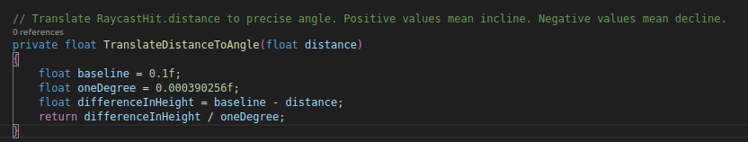
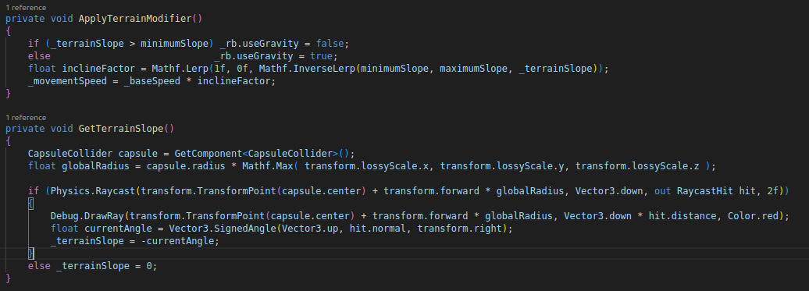

**Date: Wed 15 Sep 2025** 

# Activities

<12am - Over the weekend I explored other ways of solving my navigational problem ([day 7 - Issues/Errors Section](day7_Fri12Sep2025.md)) including  periodically spawning in a giant `SphereCollider` to get a list of each unique `GameObject` that the NPC can "see". This would be WAY more efficient but I'm still not 100% happy with this solution.

1am - Started working on a new controller component "`UniversalMovementController`" that would handle movement for all in-game entities.

1:20am - Started by sketching up a workflow diagram and assigning specific responsibilities to different entities (Entities in red). Then sketched up another diagram for the new responsibility I wanted to introduce - Applying terrain modifier to movement speed. 

2am - Explored different ways of detection of that slope. Discussed it with Bogdan. 

5am - Went ahead with 2-point precision and implemented it.

5:30am - Extrapolated the difference between center and forward with 4 different test cases and devised a simple conversion formula to convert the difference in distance to angle.

6am - Went songwriting.

4pm - Started breaking down the application of the speed modifier. Had to Redesign the way that `movementSpeed` is calculated. The following example starts applying the modifier at a 20 degree angle and maxes out at 50.

4:30pm - Built a quick scene with ramps of different angles and started applying the modifier. Encountered a problem with the distance-to-angle conversion -> **Issues/Errors section**

5pm - After solving the problem I no longer needed 2-point precision so I stuck with 1. Now the slope is being calculated accurately with just a single ray. Efficiency and effectiveness achieved.

9pm - Discussed different methods of giving NPCs something akin to eyesight with Bogdan. Went back and forth for a while. No progress.

 

# Issues/Errors

#### 4:30pm

While the distance-to-angle conversion formula itself wasn't too bad, the way Unity calculates that distance isn't very consistent or reliable. Even just moving on a perfectly flat surface, that distance can vary greatly. To solve this problem I had to change the way I got my terrain slope from:

to:

#### 8pm

This modifier, while nifty, doesn't yet solve the navigational problem. All this really accomplishes is teaching my NPC's to avoid slopes like fire. What I really need is some way to feed them information about slopes **ahead of time** and of letting them evaluate which way will hurt the least. 

 

# Next Steps

Solve the navigation problem ...

 

## Resources
