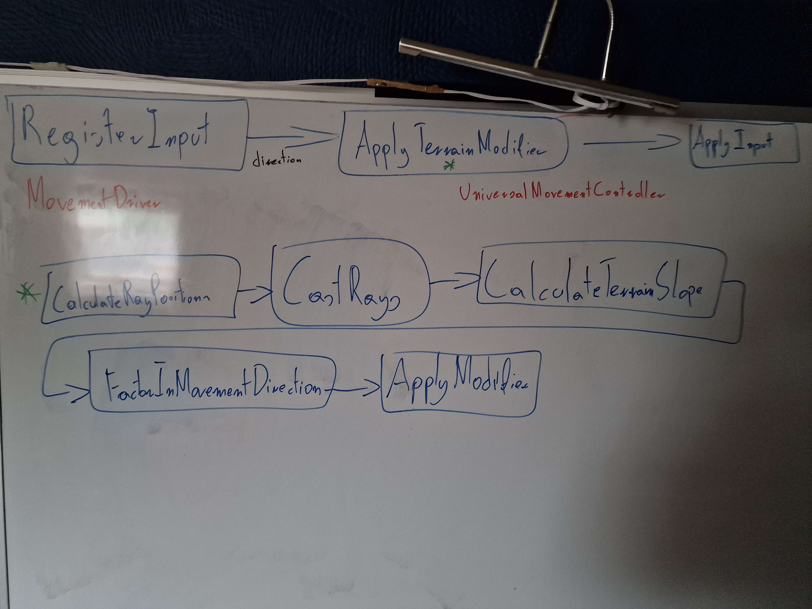
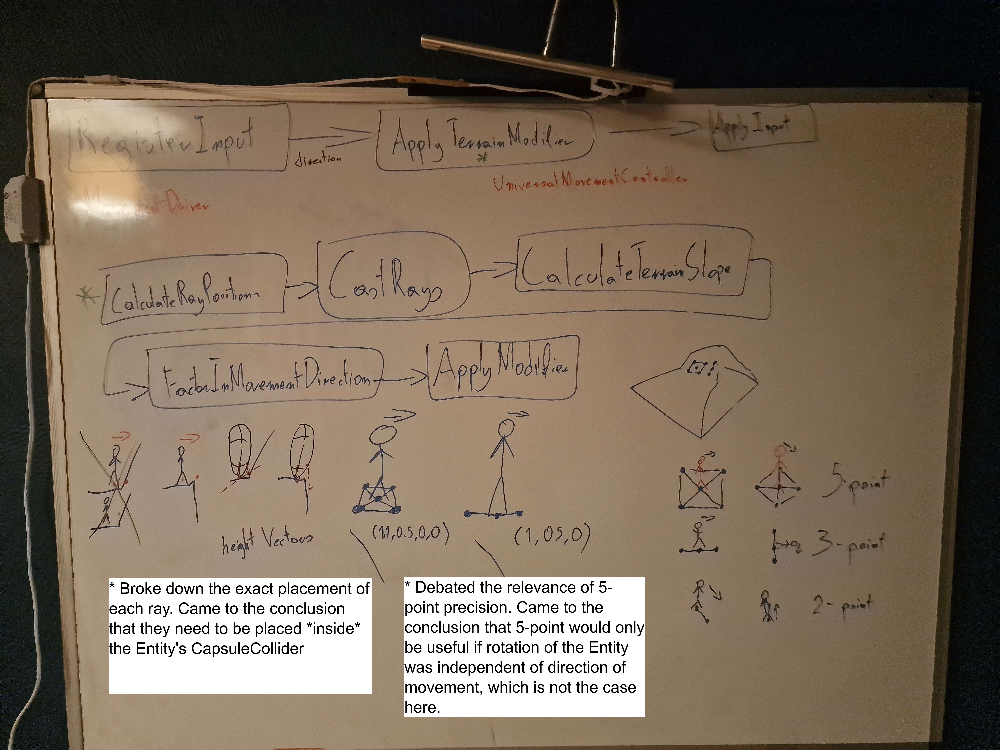
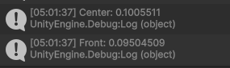
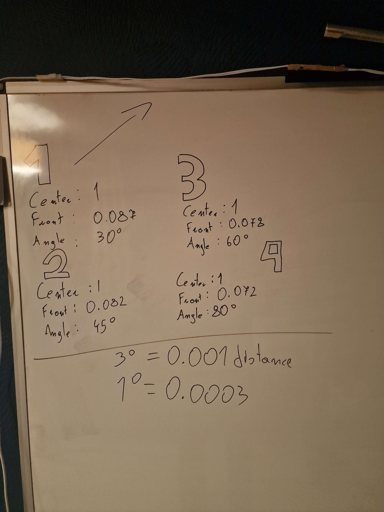
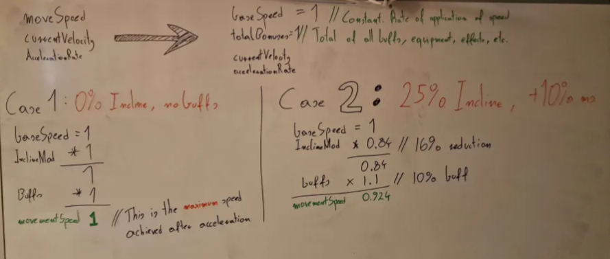
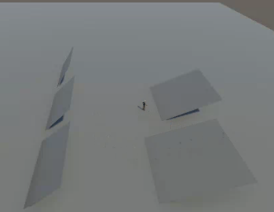

**Date: Wed 15 Sep 2025** 

# Activities

<12am - Over the weekend I explored other ways of solving my navigational problem ([day 7 - Issues/Errors Section](day7_Fri12Sep2025.md)) including  periodically spawning in a giant `SphereCollider` to get a list of each unique `GameObject` that the NPC can "see". This would be WAY more efficient but I'm still not 100% happy with this solution.

1am - Started working on a new controller component "`UniversalMovementController`" that would handle movement for all in-game entities.

1:20am - Started by sketching up a workflow diagram and assigning specific responsibilities to different entities (Entities in red). Then sketched up another diagram for the new responsibility I wanted to introduce - Applying terrain modifier to movement speed. 

2am - Explored different ways of detection of that slope. Discussed it with Bogdan. 

5am - Went ahead with 2-point precision and implemented it.

5:30am - Extrapolated the difference between center and forward with 4 different test cases and devised a simple conversion formula to convert the difference in distance to angle.

6am - Went songwriting.

4pm - Started breaking down the application of the speed modifier. Had to Redesign the way that `movementSpeed` is calculated. The following example starts applying the modifier at a 20 degree angle and maxes out at 50.

4:30pm - Built a quick scene with ramps of different angles and started applying the modifier. Encountered a problem with the distance-to-angle conversion.

9pm - Discussed different methods of giving NPCs eyesight in our Unity project with Bogdan.

 

# Issues/Errors

4:30pm - While the distance-to-angle conversion formula itself wasn't too bad, the way Unity calculates that distance isn't very constant or reliable. 

 

# Next Steps

 

## Resources
