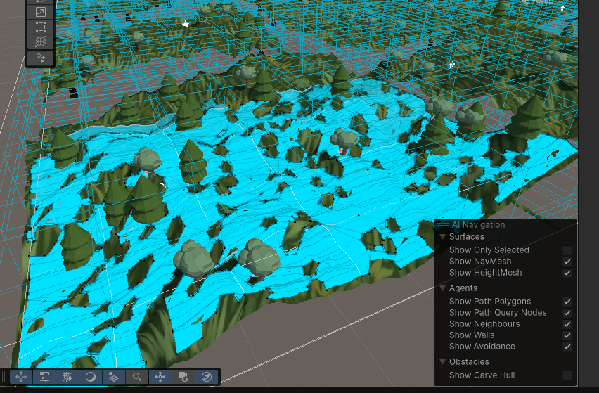

**Date: Wed 16 Sep 2025** 

# Activities

3am - Downloaded Unity's AI Navigation package and researched NavMesh.

6am - Added NavMesh to my randomized training environment.

6:15am - Applied NavMesh carving to obstacles.

 

# Issues/Errors

 

# Next Steps

 

## Resources

[Unity NavMesh Tutorial - Basics - YouTube](https://www.youtube.com/watch?v=CHV1ymlw-P8)

[AI Navigation 2.0 - NavMesh basics - YouTube](https://www.youtube.com/watch?v=SMWxCpLvrcc)
