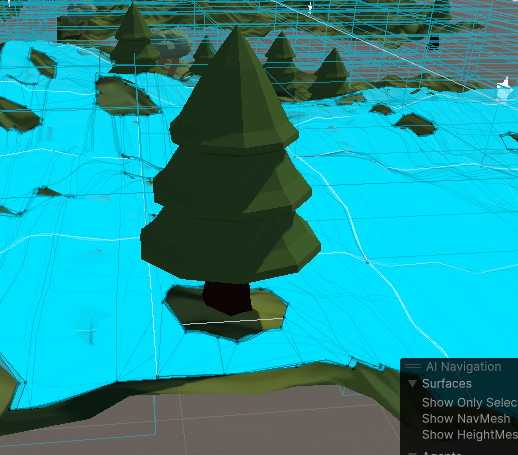
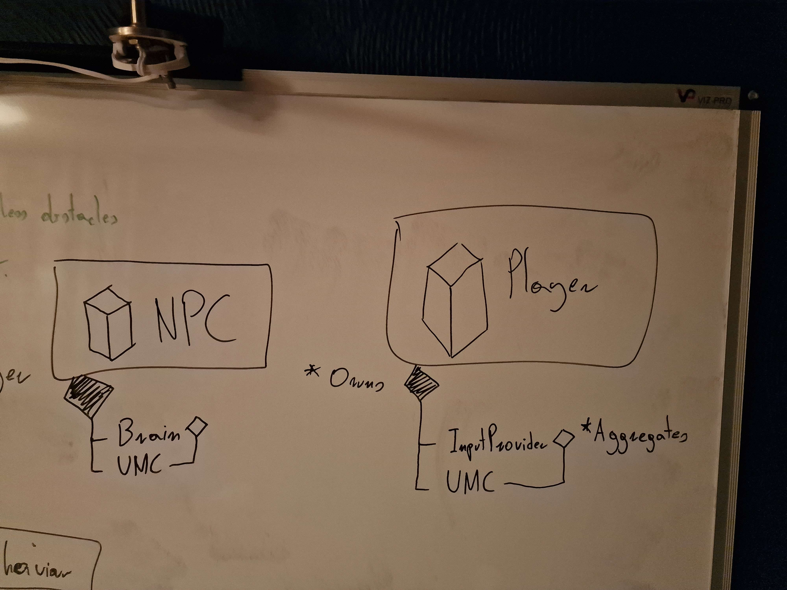
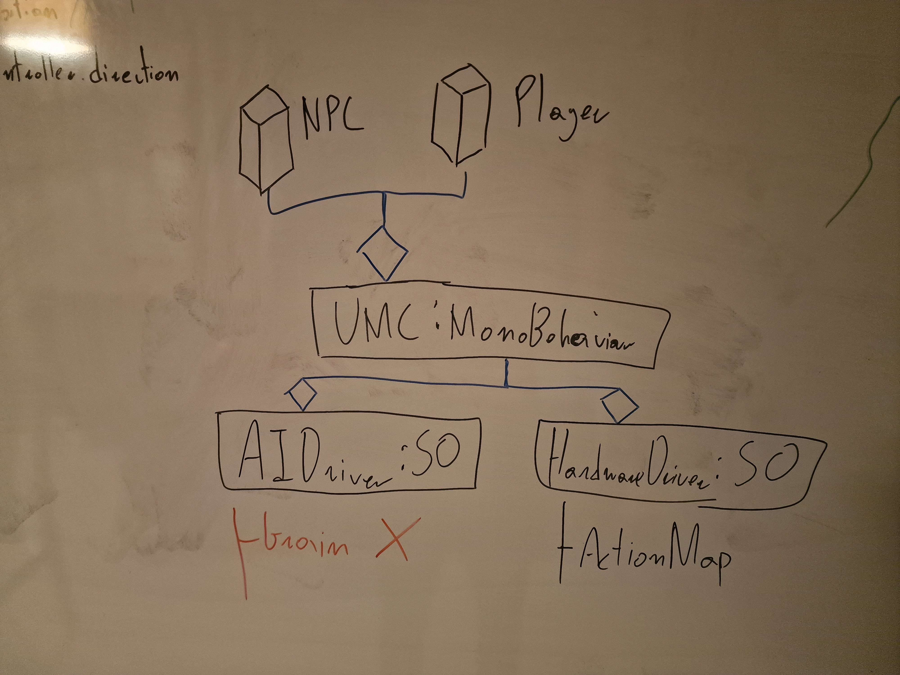

**Date: Wed 16 Sep 2025**<br>

# Activities

3am - Discovered and downloaded Unity's AI Navigation package and researched NavMesh.

6am - Added NavMesh to my randomized training environment.


6:15am - Applied NavMesh carving to obstacles.



6:20pm - Went ahead and tried giving my `Agent`s the newly made `UniversalMovementController`. Encountered Issues. Discussed it with Bogdan.

7pm - Went songwriting.

10pm - Discussed it with Bogdan again. We reached a viable solution. 



* The solution involved redesigning the `Driver` to be a `MonoBehaviour`, and instead of connecting with the provider via serialization, doing it via ordinary aggregation with `GetComponent<>()`.

11pm - Implemented the changes. With this I was finally able to apply the new `UniversalMovementController` to our `Agent`s.

11:30pm - Modified the `HumanoidNPCMovementDriver` class (previously `LocomotiveBrain`) to prioritize using `NavMesh`es and penalized ignoring it. Also rewarded speed higher than `baseSpeed`.

```csharp
// Decide how to move
public override void OnActionReceived(ActionBuffers actions)
    {
        float moveX = actions.ContinuousActions[0];
        float moveZ = actions.ContinuousActions[1];
        Vector3 movementDirection = new Vector3(moveX, 0f, moveZ);
        Vector3 targetPosition = _rb.position + movementDirection * controller.baseSpeed;

        if (!NavMesh.SamplePosition(targetPosition, out NavMeshHit hit, 0.5f, NavMesh.AllAreas))
        {
            AddReward(-0.2f);            
        }
        controller.movementDirection = movementDirection;

        RewardUsingNavMesh();
        RewardSpeed();
        RewardDistance();
        PenalizeTime();
    }
```

11:50pm - Improved observations. Added `isOnMesh` flag. Added observation of speed. Removed the `Agent`'s own position and target's position in favour of distance to the target.

```csharp
// Collect information about the environment
    public override void CollectObservations(VectorSensor sensor)
    {
        sensor.AddObservation(isOnMesh);
        sensor.AddObservation(_rb.linearVelocity.magnitude);
        sensor.AddObservation(Vector3.Distance(transform.localPosition, target.transform.localPosition));
        sensor.AddObservation(reachedGoal);
        sensor.AddObservation(lastTimeStamp);
    }
```

<br>

# Issues/Errors

#### 6:20pm

The issue is the incompatibility between the `AIDriver: ScriptableObject` and `LocomotiveBrain: Agent` classes. This suite is designed in such a way that the `Driver`s receive some kind of data from a provider, and translate that data into a `direction` that they then feed into `UniversalMovementController`. 

The core of the problem is that the `Driver` necessitates a **serialized** aggregation with the provider.

In case of the `HardwareDriver: ScriptableObject`, there was no issue with this connection because `ActionMap`s are serialized assets.

In case of the `LocomotiveBrain` however, it is a `Agent`, which is **non-serializable**. As such, the `AIDriver` is unable to reach it.



<br>

# Next Steps

<br>

## Resources

[Unity NavMesh Tutorial - Basics - YouTube](https://www.youtube.com/watch?v=CHV1ymlw-P8)

[AI Navigation 2.0 - NavMesh basics - YouTube](https://www.youtube.com/watch?v=SMWxCpLvrcc)
