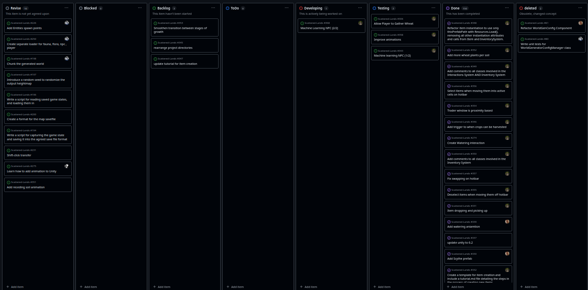

# LO 1

## 22nd October 2025

### Abstract

---

Software development is a difficult process that only gets more difficult as the applications grow in size and complexity. It should come as no surprise then that over countless trials and errors, the most efficient methods emerged and quickly got adopted across the entire industry as standards.

This article discusses my application of some of those processes, methods, techniques, and tools.

#### Processes

---

##### Scrum

Scrum is an Agile process that focuses on developing software in cycles called "sprints". Each sprint lasts a predefined amount of time (usually a week), during which the team rendezvous for daily meetings whose goal it is to make sure that the development progresses smoothly. There are also "special" meetings at the beginning and end of each sprint called plannings, reviews, and retrospectives. Those meetings ensure that all progress made is accounted for, issues are caught early, and that the team has a plan for going forward.

My biggest involvement with scrum was during 

##### Kanban

Kanban (japanese for "signboard") is a process that focuses on task atomization and management. In kanban, teams will devise a roadmap for introduction of a new (or improvement of an existing) feature called **Initiative**, and divide it into small steps  that need to be taken to develop that feature, those are called **tickets**, tracking progress of each ticket as the project progresses.

I've used kanban quite extensively in my project, the "Scattered Lands". Given the scale of the endeavour, we needed an efficient way of keeping track of our progress - Kanban emerged as the ideal candidate for that. 

Here, we defined 8 columns: 

| **Revise**                                | **Blocked**                                                                                                                                                   | **Backlog**                                | **ToDo**                                                                                     | **Developing**                                                          | **Testing**                                                                                                                                        | **Done**                                                                                                                                   | **Deleted**                                                                                                         |
| ----------------------------------------- | ------------------------------------------------------------------------------------------------------------------------------------------------------------- | ------------------------------------------ | -------------------------------------------------------------------------------------------- | ----------------------------------------------------------------------- | -------------------------------------------------------------------------------------------------------------------------------------------------- | ------------------------------------------------------------------------------------------------------------------------------------------ | ------------------------------------------------------------------------------------------------------------------- |
| Tickets that were retracted for revision. | Tickets whose completion is "blocked" by another ticket. i.e. "don't start X until Y is finished". Once Y is finished, those tickets are moved to **Backlog** | Lists available tickets that can be taken. | Tickets that are more like ideas for the most immediate future. No A/Cs, just a description. | a.k.a. "In Progress". Lists tickets that are currently being worked on. | Lists tickets whose acceptance criteria was fulfilled. Those tickets await review before either being moved back to **Developing**, or to **Done** | Completed tickets. Those tickets'  branches were merged into dev. Keeping them here allows us to catalogue pairs of branches and features. | Tickets that were rejected for whatever reason. Listing them here allows us to reevaluate those ideas at any point. |

Personally, I think that kanban is one of the most useful processes in a software developer's arsenal. Even without explicit communication, by observing the board itself, developers can get a good idea of how the application is progressing. If tickets take too long to complete, communication efforts can be made, and methods such as pair programming can be deployed to aid the effort.

##### Quality Assurance (QA)

"Quality assurance (QA) is a process that helps developers maintain the quality of their software. It defines a set of rules used to ensure that the application meets the expected specifications and requirements." (Blazejowski, Gracjan. 2025)

#### Methods

---

##### Extreme Programming (XP)

##### Test-Driven Development (TDD)

#### Techniques

---

##### Pair Programming

##### Refactoring

##### Unit Testing

#### Tools

---

##### Version Control Systems (VCS)

Version control is a project management tool that enables developers to conveniently store every unique version of their applications. For simplicity, those versions can be thought of as video game saves. Should the need arise, developers can roll back to any previous version of their application and resume development from that point onward. Many version control services (such as Github or Bitbucket) nowadays also include online views for purposes such as inspection.

Since VCS can store versions of nearly any file type, they're not only useful to developers, but other professionals as well. Graphic designers, musicians, or creative writers, can benefit from it all the same.

##### Integrated Development Environment (IDEs)

IDEs are tools that software developers use to write applications efficiently. They are in essence text editors, albeit much fancier ones. Apart from text editing functionality, they also include tools used to build, test, spellcheck, error catch, browse, and compile applications efficiently, allowing developers to put more focus on developing the actual application, and less focus on tasks such as juggling between the text editor and file browser (a.k.a. explorer), going over every line of code to catch spelling mistakes, or worrying about how they're going to compile the application.

##### Continuous Integration and Continuous Deployment (CI/CD)

CI/CD workflows are tools for automatically performing routine tasks on codebases. They can be thought of, and are often referred to, as pipelines due to their 

### References

[What is Scrum? | Scrum.org](https://www.scrum.org/resources/what-scrum-module)

*Git* (no date) Getting Started - About Version Control. Available at: [Git - About Version Control](https://git-scm.com/book/ms/v2/Getting-Started-About-Version-Control)  (Accessed: October 2025).

AWS (no date) What is an IDE? Available at: [What is an IDE? - Integrated Development Environment Explained - AWS](https://aws.amazon.com/what-is/ide/) (Accessed: October 2025).

Chinmay Gaikwad (18th October 2025) What Is CI/CD? Available at: [What is CI/CD? | Harness](https://www.harness.io/harness-devops-academy/what-is-ci-cd) (Accessed: October 2025).

*Scrum* (no date) What is Scrum? Available at: [What is Scrum? | Scrum.org](https://www.scrum.org/resources/what-scrum-module) (Accessed: October 2025).

[Kanban | Atlassian](https://www.atlassian.com/agile/kanban)
