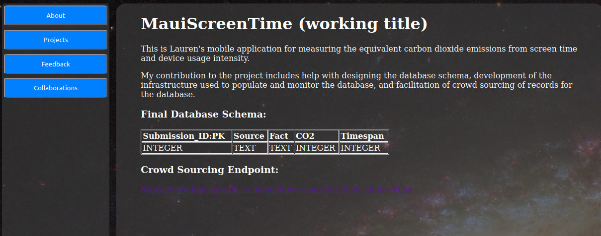

# Data Optimization and Analysis in my Personal API

#### 25th October 2025

### What?

In October 2025, I have created my first ever RESTful API that I had since built a frontend for and transformed the whole application into a website for self promotion and showcasing.

Designing the application was a big undertaking as I had to ensure that it would stay relevant for as long as possible, allowing easy and time-efficient extension in the future. The databases also had to be designed with the same goal in mind.

In addition to that the data presented needed to be easily editable, so appropriate tools needed to be made.

## So what?

##### The Expansion Problem

Designing my templates, I utilized Jinja2's blocks, which came very handy in building my 2 main base templates; `base.html` (Available at: [Personal_RESTful_API/templates/base.html at main · Ryboster/Personal_RESTful_API · GitHub](https://github.com/Ryboster/Personal_RESTful_API/blob/main/templates/base.html)), and `list_base.html` (Available at:[Personal_RESTful_API/templates/list_base.html at main · Ryboster/Personal_RESTful_API · GitHub](https://github.com/Ryboster/Personal_RESTful_API/blob/main/templates/list_base.html) ). Consider the following example:

```html
<div id="addFormContainer" class="addFormContainer" style="display:none;" onclick="this.style.display = 'none'">
        <form onclick="event.stopPropagation()" id="addForm" class="addForm" method="POST">
            <input name="_method" readonly type="hidden" value="POST">
            
            
            <button type="submit"> Submit </button>
        </form>
    </div>
```

Every one of my list endpoints (of which I now have 3) has to contain the forms used in CRUD operations on my database records. Since defining each form can take anywhere from 8 to 20 lines (in HTML alone!), defining all 4 forms could take up to 80 lines per template! This is a huge waste of space at the impediment of readability and maintainability as well as a huge time sink. Granted, it's not every day you add a new list template (like "Projects" or "Collaborations"), but when you do, you want it done quickly so you can focus on more important things like making sure that your Flask routes work.

Moving this definition off to a base template instead had vastly improved the efficiency of introduction of any potential extension.

---

##### The Depth Problem

Another problem I came across was providing each list entry with a page of its own - Kind of like a blog. Suppose you have a project called "Affordable Gun".


How could you now provide this list entry with a template dedicated to it? Since each list entry may have completely different requirements and structure, you can't just use Jinja2 blocks alone. To rephrase the problem, it was basically "How can you store different structures and content and relate them to their respective entries in an efficient way?". 

To tackle this issue, I opted to expand my tables with a `Content` field:

Before:

```sql
CREATE TABLE IF NOT EXISTS Projects
(
    Project_ID INTEGER PRIMARY KEY AUTOINCREMENT NOT NULL CHECK(typeof(Project_ID) = 'integer'),
    Name TEXT NOT NULL CHECK(typeof(Name) = 'text'),
    Description TEXT NOT NULL CHECK(typeof(Description) = 'text'),
)
```

After:

```sql
CREATE TABLE IF NOT EXISTS Projects
(
    Project_ID INTEGER PRIMARY KEY AUTOINCREMENT NOT NULL CHECK(typeof(Project_ID) = 'integer'),
    Name TEXT NOT NULL CHECK(typeof(Name) = 'text'),
    Description TEXT NOT NULL CHECK(typeof(Description) = 'text'),
    Content TEXT
)
```

and built a new universal template that provides only 2 operations: `CREATE` and `UPDATE`. Then, I incorporated CKEditor. 

By using CKEditor I can intertwine content and structure (in html), and save the whole as plaintext in my database as just a single field; `Content`! No additional tables, no join tables, no extra overhead, no additional templates!



---

##### The Concurrent Writes Problem

This website originally used the `sqlite3` library. This introduced a few unforeseen issues. 

While `sqlite3` is great for small projects as it doesn't require a local server, authentication, and has a comparetively simple syntax, it comes with a few limitations such as a limited number of supported types, a complete lack of concurrency in connections and writes, or minimal data validation. 

During my collaboration with Lauren Keenan on her application, the "MauiScreentime", I was tasked with facilitation of record sourcing for a database of hers. Since this server was already in place I decided to use it to open the submissions endpoint.

Then, I took on the task of writing an AI tool for generating the records for the database, and that's where problems really begun. The tool works in a simple way. First, it sends out a prompt to google's gemini AI and receives a correctly formatted response. Then, it iterates over the new records and sends them one by one to the submissions endpoint's API. It is at that last step when I started receiving new errors:

```
Submitting new record: 
{'Source': 'https://ourworldindata.org/co2-emissions-from-aviation',
 'Fact': 'Annual CO2 emissions from aviation amounted to 0.9 Gt (billion tonnes) in 2019.', 
 'Co2': '900000000000000', 
 'Timespan': '31536000'} 
Response: 
{"message": "database is locked"}
```

Because the bot worked so quickly, and the `requests` library has the tendency of reusing the same connections, new write requests would be sent before the old ones had the chance to conclude. In case that the `requests` library reused a connection, it could also lead to the database staying locked until the whole script terminated. Mitigating this with simple `time.sleep()` didn't help either. 

It was simply a I/O issue due to the fact that `sqlite3` doesn't have a server that it could use for pooling. When a write request comes in, the `.sqlite3` file is opened by the process, and no other process can write to it. There isn't a buffer.

I solved this issue by upgrading to `PostgreSQL`.  This library runs a local server where it can pool multiple simultaneous write requests and queue them for writing to the actual file. This finally solved the problem!


## Now what?

Incorporation of these methods allowed me to vastly reduce the amount of time and effort required to extend the website in the future. While I don't have exact figures, I can now save about 2 hours on introduction of any subsequent list page as no longer do I have to create new HTML and CSS files, and ensure that the style stays consistent across different endpoints. 

I have also created appreciative value with the addition of the `Content` field. It may not have saved me a lot of overhead now, but it will save more and more of it as the application (and consequently its usage) grows.

On top of that I have made my service a lot more reliable by upgrading to `PostgreSQL`. Now, many users can use my application simultaneously without any loss of valuable data.
