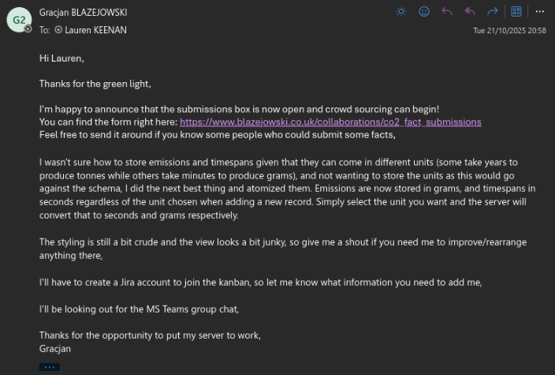

# Data Optimization and Analysis in MauiScreenTime

#### 25th October 2025

### What?

On 20th October 2025, I begun my collaboration with Lauren Keenan. My task was to build a database for storing various facts regarding Co2 emissions, and develop a record submission API for it so the facts could be crowdsourced and added to with AI simultaneously.

After a series of emails, I received the following database schema:

| Submission_ID:PK | Source | Fact | Co2  | Timespan |
| ---------------- | ------ | ---- | ---- | -------- |
| INTEGER          | TEXT   | TEXT | REAL | REAL     |

### 

### So what?

After analyzing the schema, and inspecting its implications carefully, I came across one issue. Consider the following two facts:

"`Trees absorb up to 21Kg a year`",

"`One whale can capture an average of 33 tons of carbon dioxide over its lifespan (80 years)`"

In both facts, the units for both the `Co2` and `Timespan` fields vary. This is a problem because the database schema does not include a `Unit` field, and I'm in no position as a collaborator to change it.

So, after weighing my options carefully, I decided that the best route forward is atomizing the fields, and storing their values in the smallest increments possible; grams and seconds respectively - regardless of the unit chosen in the POST form.

### Now what?

This results in two critical conversion steps that need to be taken when saving and reading the data.

When saving the data, the server needs to detect and appropriately convert the unit chosen in the form to grams, and seconds.

When reading the data, the application will have to detect the most appropriate unit for the given value and convert it again.
