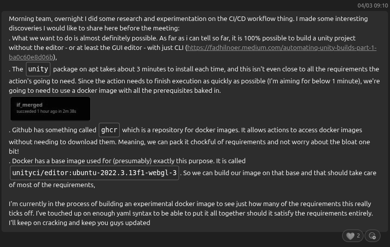
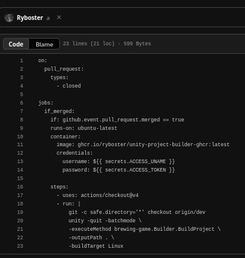
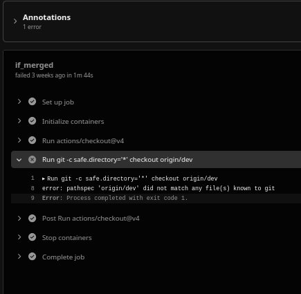

# Reflection on using the GitHub actions for the "Mash it!" project

#### 4th March 2026

### What?

On 3rd of March 2026, my team discussed the utilization of automated pipelines to streamline the testing and deployment of our project. A day later, I took the initiative to investivate the feasibility of the idea. 
I aimed to "scout ahead" for the team at large and communicate my findings to minimize time wasted should the idea prove to be unfeasible.

I came to some interesting discoveries and let the team know immediately.

 I ended up doing more than just scouting, and I charted the path ahead for the rest of the team by wrting a few experimental `.yaml` files, ultimately arriving at this one:

### So what?

I approached the task with some prior experience in GitHub actions, however, it wasn't very relevant for the task at hand so there were many unknown unknowns. 

During my research and experimentation, I've managed to produce tangible evidence suggesting that the idea is not only feasible, but actually, quite easy to implement. 

(All tasks finished successfuly except for a minor hitch with `git`)

There also turned out to have already been tools made specifically for tasks like ours, e.g. `unityci/editor:ubuntu-2022.3.13f1-webgl-3` which is a Docker base image with Unity already baked in.

### Now what?

Ultimately I wasn't able to finish the `.yaml` file fully, however, this was never the goal either way. The goal was to find out whether it was possible - and it was. 

I shared the findings of my research with the rest of the team, sent the `.yaml` file over to Sergio, brought them up to speed on my progress in a meeting, and suggested a few possible paths forward. Then, I left the rest to them so I could prioritize collecting further evidence for other learning outcomes.

### Sources

[a · Brewing-Game/brewing-game@29f1f3d · GitHub](https://github.com/Brewing-Game/brewing-game/actions/runs/22669023138/job/65708012571)

[brewing-game/.github/workflows/unity-build.yaml at yaml-test-quick · Brewing-Game/brewing-game · GitHub](https://github.com/Brewing-Game/brewing-game/blob/yaml-test-quick/.github/workflows/unity-build.yaml)
