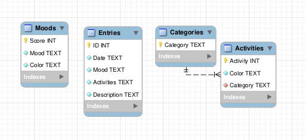
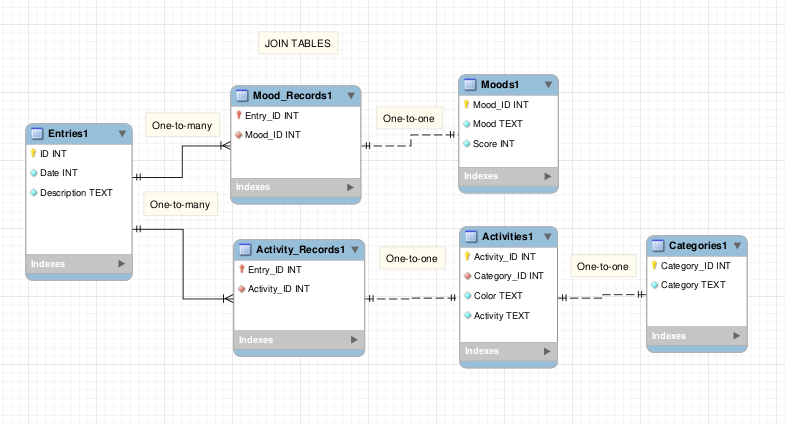

# Designed and built my first 3NF database

#### 21st September 2025

### What?

On 21st of September 2025, I have created my first-ever 3NF database schema. 

I got back to working on an application that I had begun and abandoned about a year ago. The application is an electronic journal where the user can submit entries and track their activity and progress over time.

When I had returned to the application, the biggest problem I identified was the database. It was an unnormalized form (UNF), and it had many architectural problems.

* It had one field that was not atomic - `Activities` field of `Entries` table. This field held multiple indivisable values.

* The `Activities` table could hold duplicate records because it had no UNIQUE constraints or a primary key. It only had a foreign key associated with a primary key `Category` inside `Categories` table. It was a one-to-many relationship.

* There was no database-enforced relationships between related tables and their fields, e.g. The `Mood` field of the `Entries` table had no association with the `Mood` field from the `Moods` table at the database level. This relationship only existed at the application level, which lead to some undesirable behaviours such as  having to edit both values manually. What a headache!

* 

Since the management system was split between the database level and the application level, it was incredibly difficult to trace what responsibilities were taken care of and where. It also necessitated a compensation at the application level where code had to do something that the RDBMS should be doing, often doing it less effectively and efficiently.

The lack of relationships also lead to undesired data being stored. The "Entries" table should be unable to hold a "Mood" value that doesn't exist in the "Moods" table. However, since the two fields weren't related, such a case was allowed, and "Mood" values had to be updated manually.

### So what?

This year we're learning about proper ways to manage relational databases, and recently I've learned about normalization up to the third normalized form (3NF). 

The sole goal of normalization is to reduce data redundancies and increase data integrity. This is done by strategically planning out the database structure with the aforementioned intents. This often leads to a larger number of smaller tables, each with a very fine-tuned responsibility. A stark contrast to what I had believed databases looked like.

Having read and understood the benefits of database normalization, I returned to my application with the goal of reworking that database. I have since accomplished the goal, and here is the new database schema:

I have rid the `Entries` table of 2 fields; `Moods` and `Activities`, and I've moved that responsibility to join tables `Mood_Records` and `Activity_Records`. Those tables link each unique journal entry with its activities and moods while avoiding partial dependency.

I've added all the missing relationships.

### Now what?

'Now what?' allows you to create an action plan for the future based on the previous questions.
