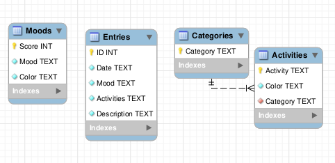

# Designed and built my first 3NF database

#### 21st September 2025

### What?

On 21st of September 2025, I have created my first-ever 3NF database schema. 

I got back to working on an application that I had begun and abandoned about a year ago. The application is an electronic journal where the user can submit entries and track their activity and progress over time.

When I had returned to the application, I made a database schema representing the current state of the database:

 It was an unnormalized form (UNF), and it had many architectural problems.

* It had one field that was not atomic - `Activities` field of `Entries` table. This field held multiple indivisable values.

* There was no database-enforced relationships between related tables and their fields, e.g. The `Mood` field of the `Entries` table had no association with the `Mood` field from the `Moods` table at the database level. This relationship only existed at the application level, which lead to some undesirable behaviours such as  having to edit both values manually.

Since the management system was split between the database level and the application level, it was incredibly difficult to trace what responsibilities were taken care of and where (spaghetti code). This compensation at the application level also decreased the efficiency of the application, and created security risks.

The lack of relationships also lead to undesired data being stored. The `Entries` table should be unable to hold a `Mood` value that doesn't exist in the `Moods` table. However, since the two fields (`Mood` and `Mood`) weren't related, such a case was allowed, and `Mood` values had to be updated manually.

### So what?

This year we're learning about proper ways to manage relational databases, and recently I've learned about normalization up to the third normalized form (3NF). 

The sole goal of normalization is to reduce data redundancies and increase data integrity. This is done by strategically planning out the database structure with the aforementioned intents. This often leads to a larger number of smaller tables, each with a very fine-tuned responsibility. A stark contrast to what I had believed databases looked like.

Having read and understood the benefits of database normalization, I returned to my application with the goal of reworking that database. I have since accomplished the goal, and here is the new database schema:

I have rid the `Entries` table of 2 fields; `Moods` and `Activities`, and I've moved that responsibility to join tables `Mood_Records` and `Activity_Records`. Those tables link each unique journal entry with its activities and moods while also enforcing atomicity for the activities. As is, the `Mood_Records` table is redundant as I could've just as well linked `Entries` and `Moods` tables directly with a foreign key, but I opted for the join table to make the design more symmetrical which helps increase the readability at no significant impact to performance.

I have also added the missing relationships to put the database itself to work, freeing up the application.

### Now what?

With these improvements, my database is now in third normalized form (3NF).

I was able to make heavy reductions in frontend and backend code, in total trimming about 400 lines worth of logic, access of nonuniform data, and redundant updates, while also improving the efficiency and scalability of the application.

If nothing else, this speaks volumes to the importance of database normalization.

In future, I'm going to always normalize my databases up to 3NF before any implementation.
