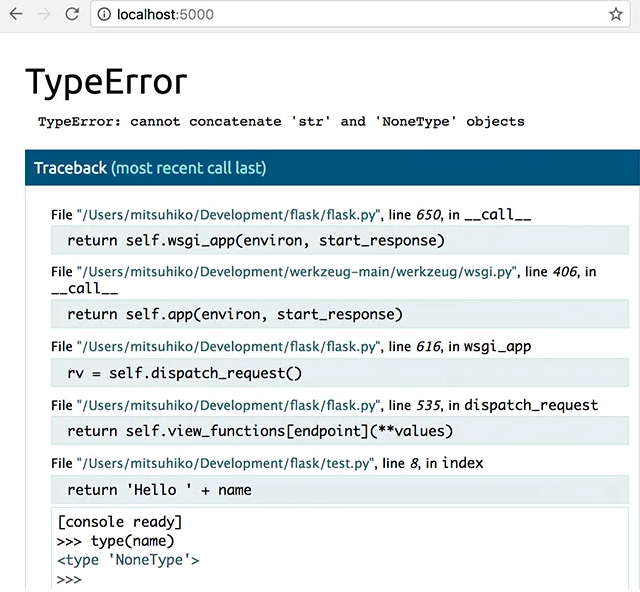
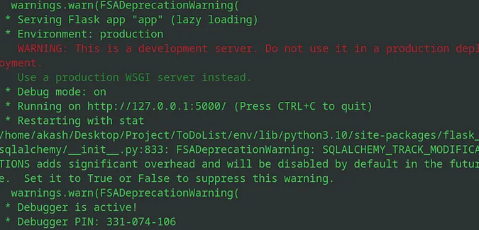

# Security Threats to my Server

#### 27th October 2025

### What?

On 26th of October, my server (https://blazejowski.co.uk/) crashed. Investigating the cause of it, I found that a crawler had made several malicious requests to my server. The cause of the crash was most likely that at the time my server was hosted on Flask and not a production WSGI (Web Server Gateway Interface) such as gunicorn, which had made it crash under concurrent load.

Normally I would censor or at least obfuscate the incoming IP addresses, however, due to the fact that the requests made were clearly of malicious nature, I do not have such scrupules. And on the contrary, exposing them here may warn others of the existing threat.
To dissect the logs, the attacker basically made two different types of attacks:

##### Retrieving Confidential Information

```log
196.251.87.200 - - [26/Oct/2025 13:08:39] "GET /.git/credentials HTTP/1.1" 404 -
196.251.117.117 - - [26/Oct/2025 14:07:14] "GET /.env HTTP/1.1" 404 -
194.163.129.51 - - [26/Oct/2025 14:56:22] "GET /admin/config.php HTTP/1.0" 404 -
204.76.203.30 - - [26/Oct/2025 15:02:12] "GET /.env HTTP/1.1" 404 -
204.76.203.30 - - [26/Oct/2025 15:02:14] "GET /.env-ssl.log HTTP/1.1" 404 -
204.76.203.30 - - [26/Oct/2025 15:02:18] "GET /.env-ssl-key HTTP/1.1" 404 -
20.65.193.168 - - [26/Oct/2025 17:17:32] "GET /owa/auth/logon.aspx HTTP/1.1" 404 -
```

They were trying to obtain:

* `.git/credentials` - This would've given them access to my github ([Git - gitcredentials Documentation](https://git-scm.com/docs/gitcredentials)).

* `admin.config` - This file likely would've contained information used to grant administrative privileges ([FreePBX Community Forums](https://community.freepbx.org/t/white-page-on-http-ip-address-admin-config-php/25495/2)).

* `ssl-key` - This is the file that's assigned to my domain on the DNS. Stealing it would've allowed them to impersonate me.

* `ssl.log` - This file contains information regarding TLS handshakes and errors during connections.

* `logon.aspx` - Here they were likely either trying to access the login page or the *logged in* page. [Use ASP.NET forms-based authentication - ASP.NET | Microsoft Learn](https://learn.microsoft.com/en-us/troubleshoot/developer/webapps/aspnet/development/forms-based-authentication)

##### Gaining Remote Access

```
204.76.203.15 - - [26/Oct/2025 17:33:08] "GET /cgi-bin/luci/;stok=/locale HTTP/1.1" 404 -
20.163.15.119 - - [26/Oct/2025 19:53:47] "GET /developmentserver/metadatauploader HTTP/1.1" 404 -
193.142.147.209 - - [26/Oct/2025 20:06:52] "GET /cgi-bin/luci/;stok=/locale HTTP/1.1" 404 -
45.207.199.28 - - [26/Oct/2025 20:37:35] "POST /cgi-bin/../../../../../../../../../../bin/sh HTTP/1.1" 404 -
45.207.199.28 - - [26/Oct/2025 20:37:37] "POST /cgi-bin/%2e%2e/%2e%2e/%2e%2e/%2e%2e/%2e%2e/%2e%2e/%2e%2e/bin/sh HTTP/1.1" 404 -
45.207.199.28 - - [26/Oct/2025 20:37:39] "POST /hello.world?%ADd+allow_url_include%3d1+%ADd+auto_prepend_file%3dphp://input HTTP/1.1" 404 -
45.207.199.28 - - [26/Oct/2025 20:37:41] "POST /?%ADd+allow_url_include%3d1+%ADd+auto_prepend_file%3dphp://input HTTP/1.1" 405 -
45.207.199.28 - - [26/Oct/2025 20:37:42] "GET /vendor/phpunit/phpunit/src/Util/PHP/eval-stdin.php HTTP/1.1" 404 -
45.207.199.28 - - [26/Oct/2025 20:37:47] "GET /vendor/phpunit/phpunit/Util/PHP/eval-stdin.php HTTP/1.1" 404 -
45.207.199.28 - - [26/Oct/2025 20:37:48] "GET /vendor/phpunit/src/Util/PHP/eval-stdin.php HTTP/1.1" 404 -
45.207.199.28 - - [26/Oct/2025 20:37:49] "GET /vendor/phpunit/Util/PHP/eval-stdin.php HTTP/1.1" 404 -
45.207.199.28 - - [26/Oct/2025 20:37:50] "GET /vendor/phpunit/phpunit/LICENSE/eval-stdin.php HTTP/1.1" 404 -
45.207.199.28 - - [26/Oct/2025 20:37:51] "GET /vendor/vendor/phpunit/phpunit/src/Util/PHP/eval-stdin.php HTTP/1.1" 404 -
45.207.199.28 - - [26/Oct/2025 20:37:53] "GET /phpunit/phpunit/src/Util/PHP/eval-stdin.php HTTP/1.1" 404 -
45.207.199.28 - - [26/Oct/2025 20:37:54] "GET /phpunit/phpunit/Util/PHP/eval-stdin.php HTTP/1.1" 404 -
45.207.199.28 - - [26/Oct/2025 20:38:01] "GET /phpunit/src/Util/PHP/eval-stdin.php HTTP/1.1" 404 -
45.207.199.28 - - [26/Oct/2025 20:38:03] "GET /phpunit/Util/PHP/eval-stdin.php HTTP/1.1" 404 -
45.207.199.28 - - [26/Oct/2025 20:38:04] "GET /lib/phpunit/phpunit/src/Util/PHP/eval-stdin.php HTTP/1.1" 404 -
45.207.199.28 - - [26/Oct/2025 20:38:06] "GET /lib/phpunit/phpunit/Util/PHP/eval-stdin.php HTTP/1.1" 404 -
45.207.199.28 - - [26/Oct/2025 20:38:07] "GET /lib/phpunit/src/Util/PHP/eval-stdin.php HTTP/1.1" 404 -
45.207.199.28 - - [26/Oct/2025 20:38:08] "GET /lib/phpunit/Util/PHP/eval-stdin.php HTTP/1.1" 404 -
45.207.199.28 - - [26/Oct/2025 20:38:09] "GET /lib/vendor/phpunit/phpunit/src/Util/PHP/eval-stdin.php HTTP/1.1" 404 -
45.207.199.28 - - [26/Oct/2025 20:38:10] "GET /laravel/vendor/phpunit/phpunit/src/Util/PHP/eval-stdin.php HTTP/1.1" 404 -
45.207.199.28 - - [26/Oct/2025 20:38:12] "GET /www/vendor/phpunit/phpunit/src/Util/PHP/eval-stdin.php HTTP/1.1" 404 -
45.207.199.28 - - [26/Oct/2025 20:38:14] "GET /ws/vendor/phpunit/phpunit/src/Util/PHP/eval-stdin.php HTTP/1.1" 404 -
45.207.199.28 - - [26/Oct/2025 20:38:15] "GET /yii/vendor/phpunit/phpunit/src/Util/PHP/eval-stdin.php HTTP/1.1" 404 -
45.207.199.28 - - [26/Oct/2025 20:38:17] "GET /zend/vendor/phpunit/phpunit/src/Util/PHP/eval-stdin.php HTTP/1.1" 404 -
45.207.199.28 - - [26/Oct/2025 20:38:18] "GET /ws/ec/vendor/phpunit/phpunit/src/Util/PHP/eval-stdin.php HTTP/1.1" 404 -
45.207.199.28 - - [26/Oct/2025 20:38:22] "GET /V2/vendor/phpunit/phpunit/src/Util/PHP/eval-stdin.php HTTP/1.1" 404 -
45.207.199.28 - - [26/Oct/2025 20:38:23] "GET /tests/vendor/phpunit/phpunit/src/Util/PHP/eval-stdin.php HTTP/1.1" 404 -
45.207.199.28 - - [26/Oct/2025 20:38:25] "GET /test/vendor/phpunit/phpunit/src/Util/PHP/eval-stdin.php HTTP/1.1" 404 -
45.207.199.28 - - [26/Oct/2025 20:38:28] "GET /testing/vendor/phpunit/phpunit/src/Util/PHP/eval-stdin.php HTTP/1.1" 404 -

```

This is a PHP payload injection. It allows the attacker to pass any arbitrary script in the payload to the server, bypassing authentication and forcing execution.

[PHPUnit eval-stdin.php Unauthenticated RCE &ndash; Alert Logic Support Center](https://support.alertlogic.com/hc/en-us/articles/115005711043-PHPUnit-eval-stdin-php-Unauthenticated-RCE)

### So what?

This -colloquially speaking- lit my behind on fire, and scared, I decided to sacrifice the day to better prepare against such attacks in the future. I took my server down, and drafted and executed a 5-step plan:

---

#### Turned off Debug Mode

Debug mode is a tool made for developers while the application is still in early stages of development. When errors occur, it provides us with detailed information as to *where* and *why* the error occurred. An example of that may look something like this:



As you can see, this exposes not only the specific server error that occurred, but also shows us a snippet of the actual code. Often times during development, the environment isn't fully set up yet, and developers may hard code certain secrets in their code. If an error were to occur while the server is in production, this could lead to those secrets being exposed to malicious actors.

In case of Flask in particular however, there is a much more serious risk as Flask provides us with a `/console` endpoint. This endpoint acts as a shell terminal and can be used to execute malicious code remotely. If the bad actors were to gain control of it, they could -in principle- completely seize control of your device or even *multiple devices* on the same local network.



I've since turned off the debug mode in my Flask application which closed all of those avenues.

 Poudel, Akash. (2022) Hacking the Debugging Pin of a Flask Application. Available at: https://b33pl0g1c.medium.com/hacking-the-debugging-pin-of-a-flask-application-7364794c4948 (Accessed: 28th October 2025).

---

#### Altered Directory Structure

At first I stored all my sensitive files such as `fullchain.crt`, `private.key`, `log.txt`, or `db_creds.json` in my project's root directory (same directory as my `main.py`). This can pose a threat since a server is essentially just that - a file serving application. Since those files were within its scope, someone could've just asked my server "hey, fetch me the file called "`fullchain.crt`" located at /.", and the server would comply unless such a case was explicitally prevented.

I've since eliminated all of those files and used environment variables instead. `start.sh` was replaced by a `CMD` block in my docker container. `log.txt` has been moved outside of the scope of the server, and `db_creds.json` was replaced with environment variables. Although environment variables are generally regarded as safer than files, one other way in which this threat could be mitigated is restructuring the directory structure in the following way:

```
Personal_Website
├── Personal_RESTful_API
│   ├── main.py
├── db_creds.json
├── log.txt
└── start.sh
```

and in case of `private.key` and `fullchain.crt`, I've moved them to`/etc/nginx/ssl/` to let nginx take care of securing them.

---

#### Containerized Application

If the malicious actor was to succeed at gaining remote access to my server, they would've had complete control over my device's files and interfaces, allowing them to not only seize all of my confidential files, but also spread to other devices on the network,

While I can't really predict what tactic hackers might use to try this again, to protect myself against the consequences of any successful attempt, I used `docker` to create an isolated environment from which the server now runs. Since my server uses `PostgreSQL`, I've created two separate containers so that even if the malicious actor somehow gains control over the server container, my database and all of its git backup mechanisms are safe (at least in principle).

```docker
FROM python:3.11-slim

RUN apt-get update && apt-get install -y \
    nginx \
    nano \
    fail2ban \
    python3-dev \
    supervisor \
    && apt-get clean \
    && rm -rf /var/lib/apt/lists/*

WORKDIR /app

COPY Personal_RESTful_API/ /app/
COPY requirements.txt /app/
COPY nginx /etc/nginx
COPY fail2ban /etc/fail2ban
COPY supervisord.conf /etc/supervisor/conf.d/supervisord.conf

RUN pip install --no-cache-dir -r requirements.txt
RUN chmod +x /app/start.sh
EXPOSE 80 443

CMD ["supervisord", "-n", "-c", "/etc/supervisor/conf.d/supervisord.conf"]
```

```conf
[supervisord]
nodaemon=true

[program:nginx]
command=/usr/sbin/nginx -g "daemon off;"
autorestart=true
stdout_logfile=/var/log/nginx.log
stderr_logfile=/var/log/nginx_err.log

[program:gunicorn]
command=gunicorn main:app
directory=/app
autorestart=true
stdout_logfile=/var/log/gunicorn.log
stderr_logfile=/var/log/gunicorn_err.log

[program:fail2ban]
command=/usr/bin/fail2ban-server -xf
autorestart=true
stdout_logfile=/var/log/fail2ban.log
stderr_logfile=/var/log/fail2ban_err.log
```

---

#### Used Nginx and Gunicorn

To address the problem of concurrency, and somewhat increase the security of my application by eliminating Flask's "hand-holding" exploits, I moved to running the application via WSGI (Web Server Gateway Interface) on gunicorn. Gunicorn can be allegorized to a ventroliquist. Frameworks such as Flask or Django attach "strings" to the endpoints and methods of application built on them. Those "strings" then allow other applications to control (or puppeteer) them via a standardized convention called WSGI. This is of course just an analogy, as nothing is actually "attached". In reality, it's simply that Flask's and DJango's `App` objects provide those interfaces, and applications such as Gunicorn or Vunicorn can use them.

To then further protect my application, I also needed a way to deny malicious requests before they ever reach my gunicorn server. To address this problem, I used `Nginx` as a reverse proxy, and 

```
    server 
    {
        listen 443 ssl;
        server_name www.blazejowski.co.uk;
        ssl_certificate /etc/nginx/ssl/fullchain.crt;      ### Let Nginx take care of securing my SSL certs
        ssl_certificate_key /etc/nginx/ssl/private.key;
        ssl_protocols TLSv1.2 TLSv1.3;                     ### Chucked out the obsolete v1.1
        ssl_ciphers HIGH:!aNULL:!MD5;

        if ($query_string ~* "(auto_prepend_file|allow_url_include|php://|data://|expect://|%2f%2f|%3a%2f%2f)") {
            return 403;
        }
    
        ## Block higher level access
        if ($request_uri ~* "\.\.")
        {
            return 403;
        }

        ### Block special characters
        location ~ "^/[!?\$%\^]" {
            return 403;
        }

        ### Block fishy paths
        location ~* /(etc|php|env|venv|robots|owa|admin|auth|aaa9|aab9|cgi-bin|developmentserver|metadatauploader|vendor|hello\.world|phpunit|lib|laravel|www|yii|zend|ws|V2|test|tests|testing)
        {
            return 403;
        }

        ### Block sensitive extensions
        location ~* /.*\.(env|git|log|sql|ht|bak|zip|tar|key|sqlite3|txt|md|crt|conf|sh|pyc|cfg|php|local|d) 
        {
            return 403;
        }

        location / {
            proxy_pass http://127.0.0.1:8001;
            proxy_set_header Host $host;
            proxy_set_header X-Forwarded-For $proxy_add_x_forwarded_for;
            proxy_set_header X-Forwarded-Proto https;
        }
    }
```

[Configuring HTTPS servers](https://nginx.org/en/docs/http/configuring_https_servers.html)

---

#### Implemented Fail2Ban

The previous measures address the security of my application, and indeed, implementation of those has vastly increased my confidence that no low-level attack will pose much of a threat to me anymore. However, even if my server can (hypothetically speaking) confidently shrug off 100% of the attacks, it doesn't matter much if the attacker sends a million requests per second. In case of a DDOS (denial of service) attack, it is important that the server can also "attack" back in some way. 

This is where the `Fail2Ban` framework comes in. By analyzing my proxy's (Nginx's) logs, and filtering out unwanted requests, I can automatically ban repeated offenders, vastly freeing up the resources of the application so it can continue serving genuine users.

Since I've set up my reverse proxy to send 403 responses on known attacks, I can now capture those events using regular expressions and ban repeating offenders in my `iptables`

*/etc/fail2ban/jail.local*:

```
[nginx-403]
enabled = true
port = http,https
filter = nginx-403
logpath = /var/log/nginx/access.log
maxretry = 3
findtime = 600
bantime = 3600
action = iptables-multiport[name=nginx-403, port="http,https", protocol=tcp]
```

*/etc/fail2ban/filter.d/nginx-403.conf*:

```
[Definition]
failregex = ^<HOST> - - \[.*\] "(GET|POST|HEAD|OPTIONS|PUT|DELETE).*" 403 .*
ignoreregex =
```

### Now what?

All in all I was very lucky that the malicious user's bot targeted the PHP framework and not 
